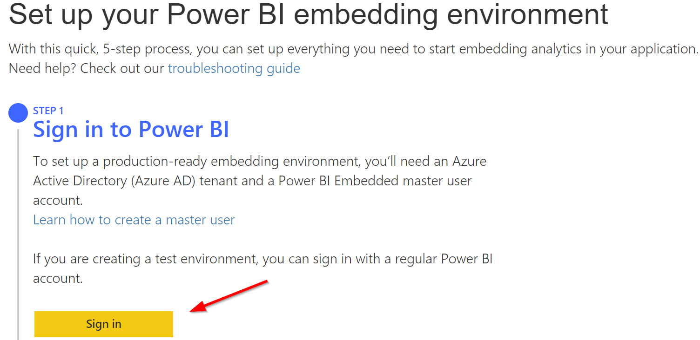
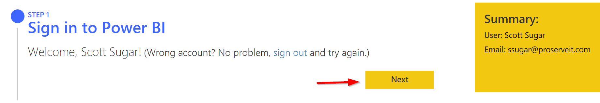
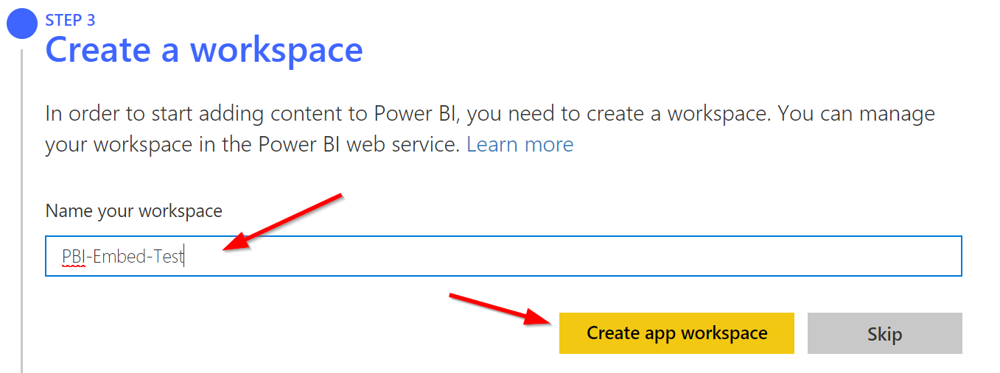
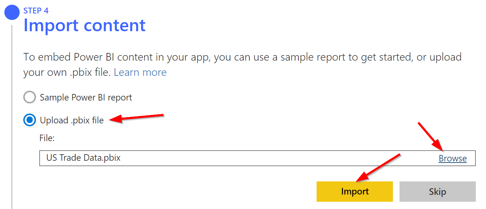
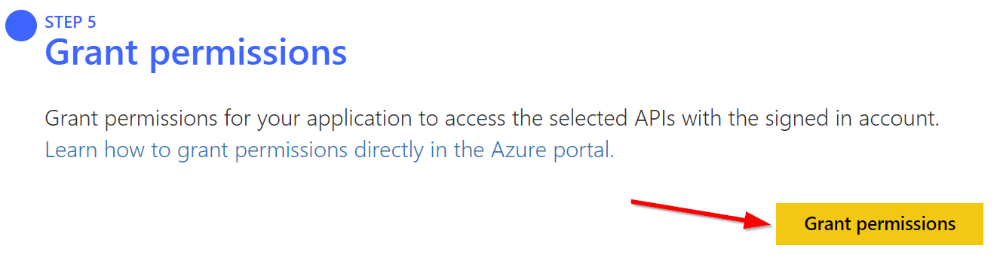

# MS Power BI Embedded - Creating a Custom .NET MVC App
###### by [Scott Sugar](https://linkedin.com/in/scottsugar)

This is the first of a 3-part series on PowerBI Embedded.  This series is meant for a technical audience.  An executive-focused article on PowerBI Embedded can be found [here](./Embedded-exec.md).

For this series, we'll be focused on the PowerBI Embedded A-Series (Azure) SKU, and we'll be using the "App Owns Data" model, which is the model that allows you to embed Power BI reports for your customers.  More information on this model can be found [here](https://docs.microsoft.com/en-us/power-bi/developer/embedding#embedding-for-your-customers).

### Requirements

* An Azure Active Directory tenant (if you'd like to set up a full production environment), or a regular Power BI Pro account (can be used to set up a test environment)
* Visual Studio - Free Community version is available [here](https://visualstudio.microsoft.com/vs/community/)

### Set up your Power BI embedding environment

To set up your Power BI embedding environment, go to: [https://app.powerbi.com/embedsetup/AppOwnsData](https://app.powerbi.com/embedsetup/AppOwnsData).  Then run through the steps as described below:

1. Step 1 - Sign in to Power BI
    1. Sign in with an account used for the Power BI service.
    2. Click Next

2. Step 2 - Register Application.
    1. First enter the name of the application.
    2. Next, select the access permissions.  For the purposes of this series, we only need to read reports, so we'll limit our access to just that.
    3. Finally, click "Register"

3. Step 3 - Create the Power BI App Workspace
    1. First enter the name of the app workspace.
    2. Click "Create app workspace"

4. Step 4 - Upload a sample Power BI Report
    1. Download this [.pbix file](https://github.com/ssugar/Blog/raw/master/Embedded/pbix/US%20Trade%20Data.pbix) that we'll use for this series of articles
    2. Select "Upload .pbix file"
    3. Browse to the location where you saved the [.pbix file](https://github.com/ssugar/Blog/raw/master/Embedded/pbix/US%20Trade%20Data.pbix)
    4. Click "Import"

5. Step 5 - Grant Permissions
    1. Click "Grant Permissions"

### Get Started with MS Power BI Today
There are so many things MS Power BI can do to increase data visibility and improve decision making within your organization. So, let’s recap a few important points about why you need MS Power BI in your organization.

MS Power BI is data import, modeling, and visualization made easier.  It can be a self-service data visualization tool for your end-users, or we can help build reports and dashboards for you.  MS Power BI has desktop and mobile clients - even for Apple Watch - along with web-based dashboards and reports, making your data and KPIs easy to access from any device at any time.

Simply put, MS Power BI is an extremely versatile Business Intelligence platform. If you want to learn more about how to take full advantage of MS Power BI, [drop us a line today](mailto:cloud@proserveit.com?Subject=I%20Want%20To%20Learn%20More%20About%20Power%20BI%20Solutions). Our team of Data & Analytics experts will be happy to schedule a demo or a tutorial session.