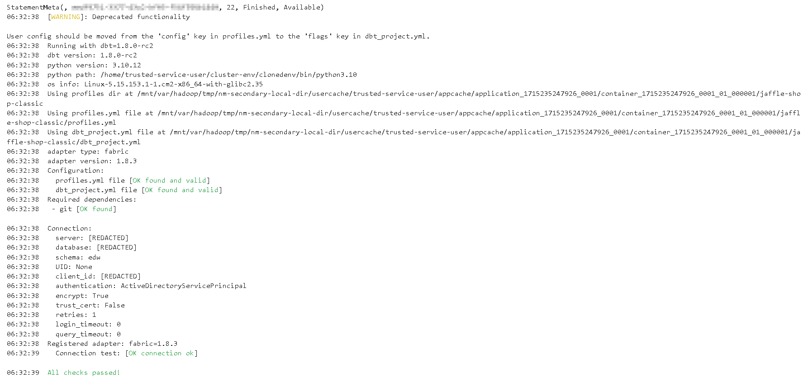
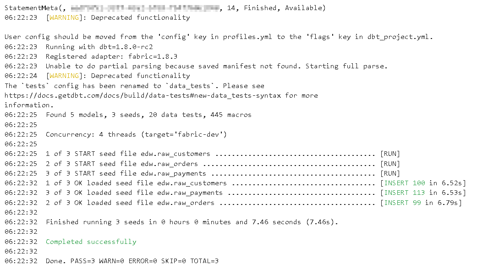
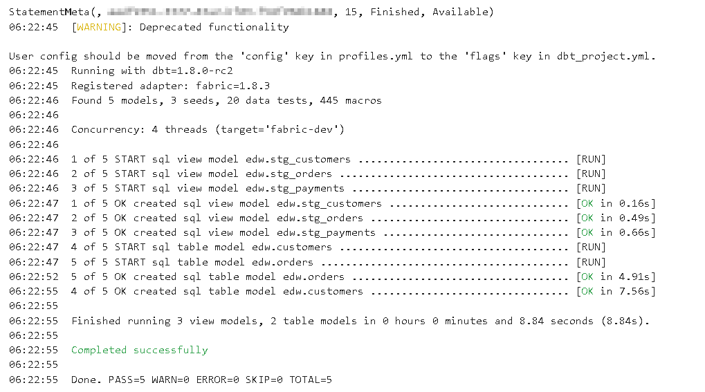

# Running DBT with the dbt-fabric Adapter in a Fabric Notebook

Transforming your data warehouse just got easier with the ability to run DBT (Data Build Tool) completely inside a Fabric Notebook. This guide will walk you through the process using the `jaffle-shop-classic` GitHub repository and connecting to a Fabric Warehouse using the `dbt-fabric` adapter.  All of this will be accomplished within the context of a Fabric Notebook - no need for any local development.

We will be using the `jaffle-shop-classic` repository instead of the newer `jaffle-shop` repository as the classic version does not have warehouse specific macros which result in errors with the `dbt-fabric` adapter

## **Prerequisites**

You'll need:
1. An MS Entra App (service principal) with Contributor permissions on a Fabric Workspace 
2. An Azure Key Vault - the user running the notebook will need access to GET secrets
3. Git Installed in the same Fabric Workspace - see [Using Git in Fabric](./UsingGitInFabric.md)
4. A Fabric Warehouse
5. A Fabric Notebook

## **Step 1: Install dbt-Fabric into your Fabric Notebook**

This command installs the dbt-fabric adapter:

```markdown
%%bash
pip install -U dbt-fabric
```

After that, you can check the version of dbt core and dbt-fabric that are installed:

```markdown
%%bash
dbt --version
```

## **Step 2: Clone the jaffle-shop-classic repository**

```markdown
%%bash
git clone https://github.com/dbt-labs/jaffle-shop-classic/
```

*Note this will only work if you've followed the instructions at [Using Git in Fabric](./UsingGitInFabric.md)*

## **Step 3: Setting Up the `dbt-fabric` Adapter**

To connect to a Fabric Warehouse, you'll use the `dbt-fabric` adapter. This requires setting up a `profiles.yml` file with the necessary configurations:

```markdown
%%bash
cd jaffle-shop-classic
rm ./profiles.yml
touch ./profiles.yml
echo 'config:' >> ./profiles.yml
echo '  partial_parse: true'  >> ./profiles.yml
echo 'jaffle_shop:'  >> ./profiles.yml
echo '  target: fabric-dev'  >> ./profiles.yml
echo '  outputs:    '  >> ./profiles.yml
echo '    fabric-dev:'  >> ./profiles.yml
echo '      authentication: serviceprincipal'  >> ./profiles.yml
echo '      driver: ODBC Driver 18 for SQL Server'  >> ./profiles.yml
echo '      schema: edw'  >> ./profiles.yml
echo '      threads: 4'  >> ./profiles.yml
echo '      type: fabric'  >> ./profiles.yml
```

Above sets up the basics of a dbt-fabric connection.  

Next you'll add in your Fabric:
* host (AKA SQL Connection String) - kept in a secret named fabric-host
* database (Name of your Fabric Warehouse) - kept in a secret named fabric-database

And your MS Entra App (service principal) details:  
* tenant_id - kept in a secret named aad-tenant
* client_id - kept in a secret named aad-client
* client_secret - kept in a secret named aad-secret

Make sure to replace KEYVAULTNAME with the name of your Azure Key Vault.  We will retrieve all of these details from an Azure Key Vault to keep them secure.

```markdown
HOST = mssparkutils.credentials.getSecret("https://KEYVAULTNAME.vault.azure.net/","fabric-host")
DATABASE = mssparkutils.credentials.getSecret("https://KEYVAULTNAME.vault.azure.net/","fabric-database")
TENANT = mssparkutils.credentials.getSecret("https://KEYVAULTNAME.vault.azure.net/","aad-tenant")
CLIENT = mssparkutils.credentials.getSecret("https://KEYVAULTNAME.vault.azure.net/","aad-client")
SECRET = mssparkutils.credentials.getSecret("https://KEYVAULTNAME.vault.azure.net/","aad-secret")
!cd jaffle-shop-classic; echo "      host: $HOST" >> ./profiles.yml
!cd jaffle-shop-classic; echo "      database: $DATABASE" >> ./profiles.yml
!cd jaffle-shop-classic; echo "      tenant_id: $TENANT" >> ./profiles.yml
!cd jaffle-shop-classic; echo "      client_id: $CLIENT" >> ./profiles.yml
!cd jaffle-shop-classic; echo "      client_secret: $SECRET" >> ./profiles.yml
```

## **Step 4: Test the DBT Package and Fabric Warehouse Connection**

```markdown
%%bash
cd jaffle-shop-classic
dbt debug --profile jaffle_shop
```

Output should look like this:



## **Step 5: Seed the Fabric Warehouse with data**

```markdown
%%bash
cd jaffle-shop-classic/
dbt seed --profile jaffle_shop
```

Output should look like this:



## **Step 6: Running the DBT Package**

With the `dbt-fabric` adapter configured and the package downloaded, you can execute your DBT project:

```markdown
%%bash
cd jaffle-shop-classic
dbt run --profile jaffle_shop
```

This will run all the models, tests, and snapshots defined in your DBT project, leveraging the power of the Fabric Warehouse for your data transformations.

Output should look like this:



## **Conclusion**

By running DBT inside a Fabric Notebook with the `dbt-fabric` adapter, you centralize your data transformation process, enhance security with Azure KeyVault, and improve collaboration by eliminating the need for a local development environment. The `jaffle-shop-classic` repository's compatibility with Fabric Warehouse ensures a smooth and efficient workflow to test DBT in Fabric.
