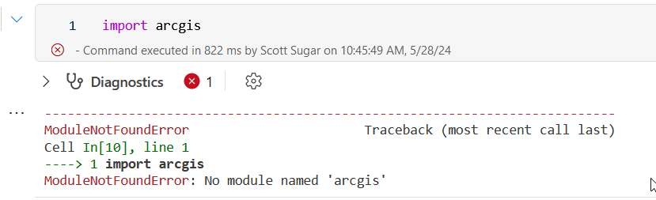
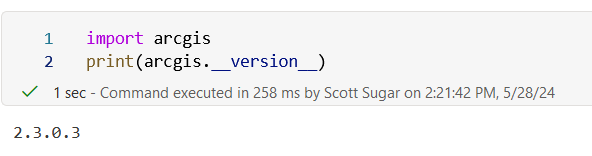

# Installing the ArcGIS Python Module in a Fabric Notebook

## Introduction
In this article, we'll explore the process of installing the ArcGIS Python module in a Fabric notebook. We'll first look at a common mistake made during installation and then provide the correct method to ensure a smooth setup.

:warning: Please note that this won't give you 100% of the functionality of the ArcGIS python module, but will allow you to upload tables/shapefiles, publish feature sets, change owners and a number of other administrative & data related tasks.

## Common Mistake: Incorrect Installation Method
You might be tempted to install the ArcGIS module directly using `pip` in your Fabric notebook like this:

```python
%pip install arcgis
```

Doing the above will result in a number of errors when installing various dependencies and if you then try to test your installation of the ArcGIS module, you'll see the module didn't install resulting in a ModuleNotFoundError: No module named 'arcgis' error when importing.

```python
import arcgis
```



## Correct Installation Method
This method will install the ArcGIS python module with it's --no-deps option which doesn't force pip to try and install all it's dependencies.  You'll also manually install all the core required dependencies.

```python
%pip install ujson
%pip install six
%pip install requests
%pip install cryptography
%pip install cachetools
%pip install lxml
%pip install ntlm_auth
%pip install requests_oauthlib
%pip install requests_toolbelt
%pip install requests_ntlm
%pip install geomet
%pip install puremagic
%pip install dask[dataframe]
%pip install keyring
%pip install pylerc
%pip install pyshp
%pip install arcgis --no-deps
```

## Test Your Install
The following commands will import the installed ArcGIS module and print the installed version number.

```python
import arcgis
print(arcgis.__version__)
```


## Conclusion
By following the correct method outlined above, you can install the ArcGIS Python module in your Fabric notebook without any issues.

Happy geospatial analysis!
