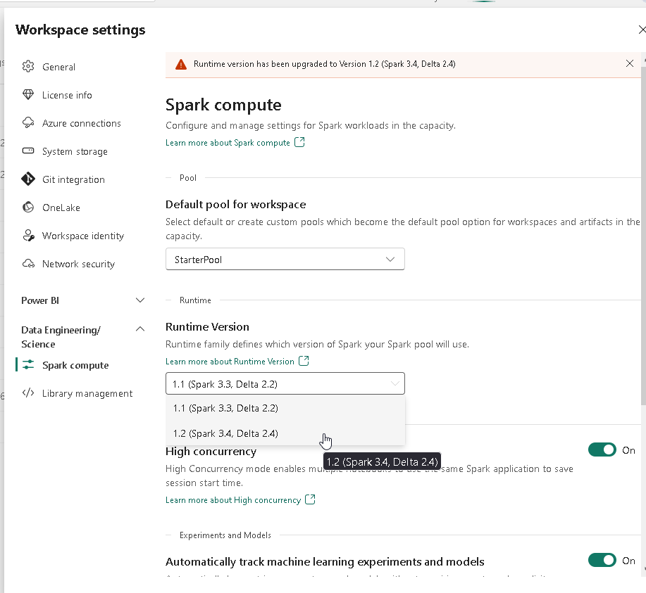
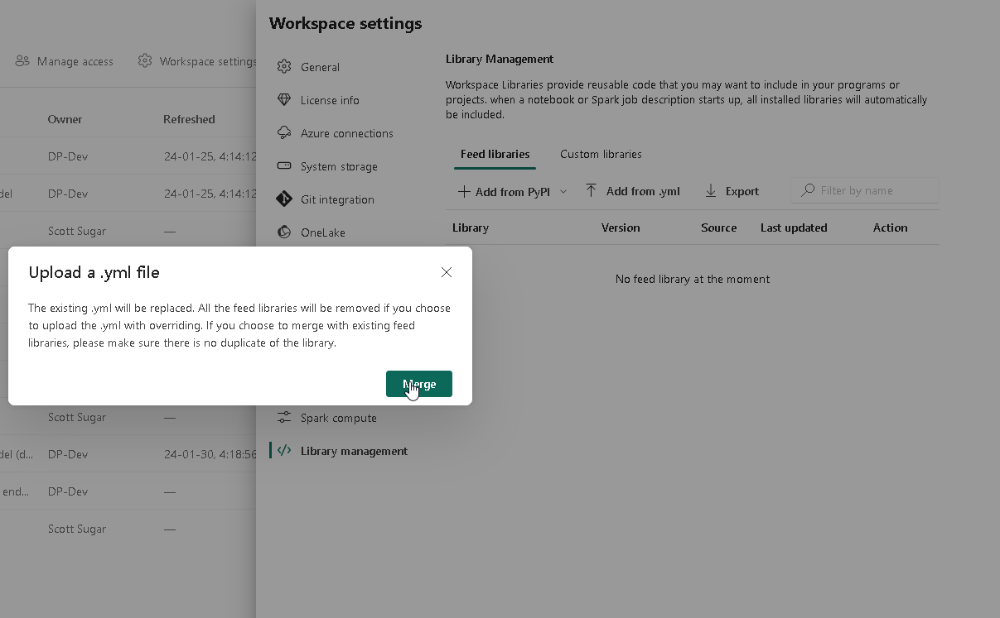
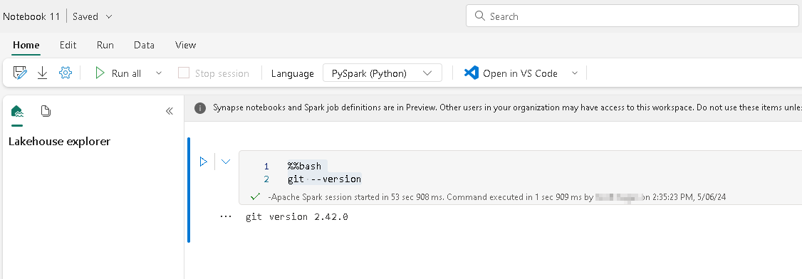

### Using Git in Microsoft Fabric Notebooks

When working in Microsoft Fabric Notebooks, sometimes it can become necessary to clone a repository for use in the notebook.  One example of this necessity is when working with DBT packages for data transformation.

### How to setup git in Microsoft Fabric Notebooks

## Ensure your workspace is using Runtime 1.2

1. Go to your desired workspace
2. Click on "Workspace settings"
3. Click on "Data Engineering/Science
4. Click on "Spark compute"
5. In the "Runtime Version" dropdown, select "1.2 (Spark 3.4, Delta 2.4)"
6. Click "Save"



## Create a .yml file

1. Open up notepad, paste in the following and save it as a .yml file

```yaml
name: Fabric1.2_GitWorkaround
channels:
  - conda-forge
  - defaults
dependencies:
  - git
```

## Load the .yml file into your workspace

1. Go to your desired workspace (same one we confirmed is using Runtime 1.2)
2. Click on "Workspace settings"
3. Click on "Data Engineering/Science
4. Click on "Library management"
5. Click on "Add from .yml"
6. Select the .yml file created above
7. Click "Merge" in the pop up
8. Click "Apply" and "Apply" again



This change will then process in the background - it can take 20-30 minutes.

## Confirm git is working in your notebook

1. Place the following code into a new notebook in the desired workspace

```python
%%bash
git --version
```

Output should look like this:



#### **Conclusion**

Having the ability to clone repositories into Fabric notebooks will further improve the usability of Fabric notebooks - especially when trying to work with DBT packages to enhance your data transformation capabilities.
