# Power BI Usage Metrics across all WorkSpaces
###### by [Scott Sugar](https://linkedin.com/in/scottsugar)

## Problem Statement
"You can't manage what you can't measure".  So when it comes to managing your tenant's online Power BI service, how do you measure the usage of your reports, dashboards, and datasets?  Which reports are getting the most attention?  By who?  Are there unused reports or workspaces that could be cleaned up?

There are Usage metrics at the report/dashboard level that can be saved, edited, and unfiltered to show usage across an entire workspace, but for organizations with more than a few workspaces, monitoring usage at the workspace level is not scalable and doesn't allow for a unified view of usage across the tenant.

The online PowerBI service does offer Usage metrics in the Admin portal, but it's not customizable or interactive, and seems to be more focused on "who has how many reports/dashboard" rather than the question I set out to answer "who's using the service, and what are they looking at?"

Power BI Built-In Usage Metrics in the Admin portal:


## Solution Walkthrough

### Set up Pre-Requisites
We have a few things we need to set up in order to get this solution working:
* Azure AD Global Admin account
* Azure AD Application - to help us authenticate to the O365 Management APIs
* Power BI Streaming Dataset - to hold the Power BI activity logs

#### Create an Azure AD Application

1. Login to Azure AD Admin Portal and Create a new Azure AD Application
   * A) Click App Registrations
   * B) Click New Registration

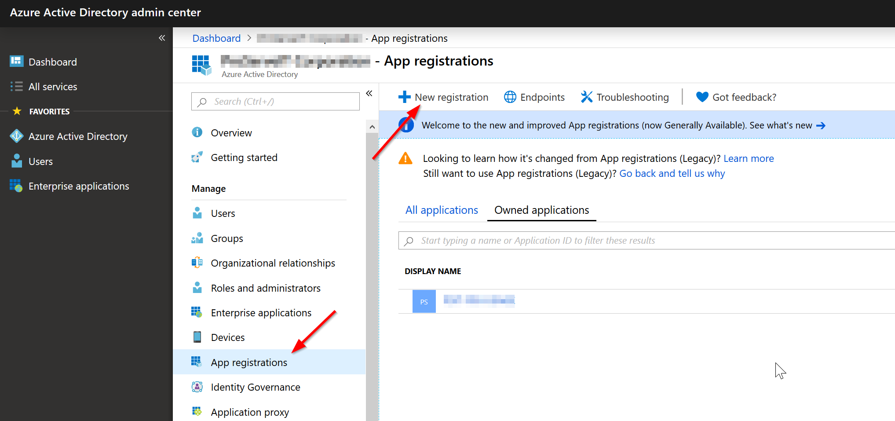

2. Register Azure AD Application
   * A) Enter Application Name
   * B) Select Supported Acccount Types (default is fine if just gather activity logs for one tenant)
   * C) Click Register

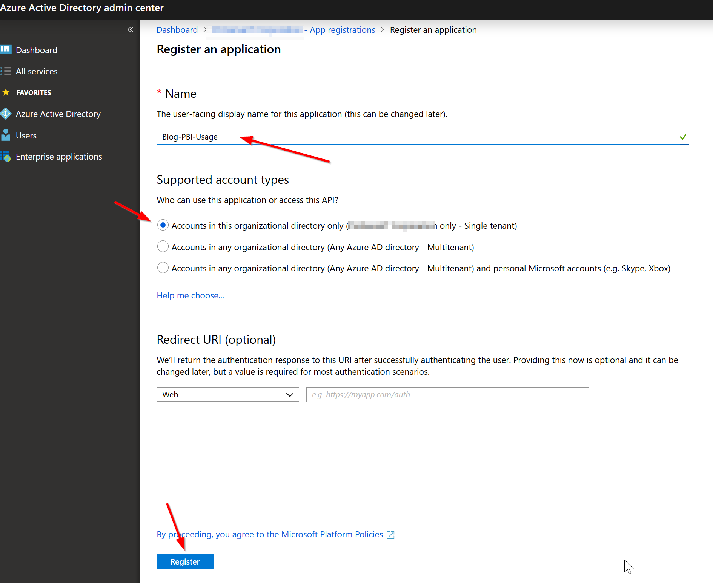

3. Add API Permissions
   * A) Click API Permissions
   * B) Click "Add a permission"
   * C) Click "Office 365 Management APIs"

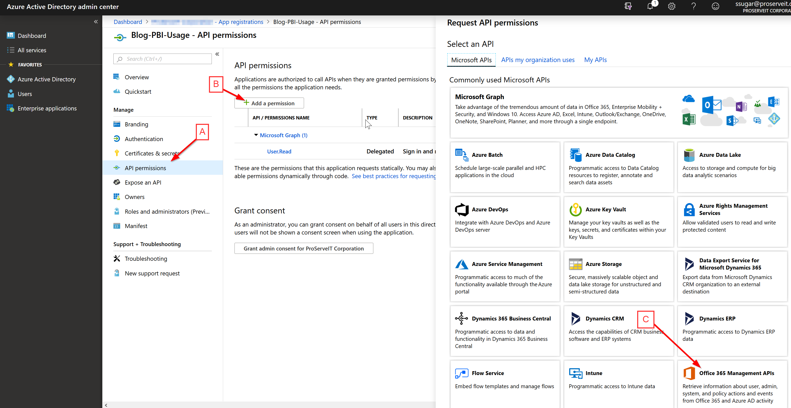

4. Request API Permissions
   * A) Click "Application Permissions"
   * B) Select ActivityFeed.Read
   * C) Select ServiceHealth.Read
   * D) Click "Add permissions"

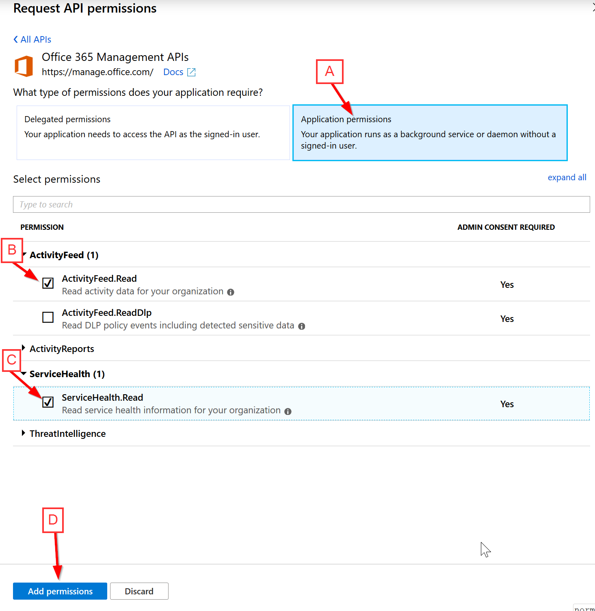

5. Grant admin consent for your org
   * A) Click "Grant admin consent for ..."

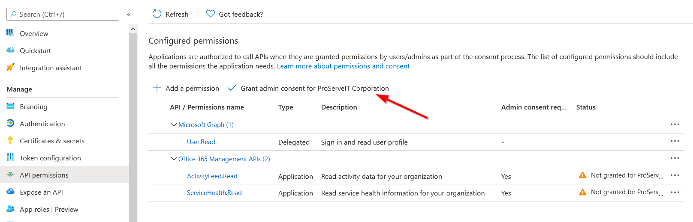

6. Gather Application (client) ID, and Directory (tenant) ID
   * A) Click Overview
   * B) Copy the Application ID and Directory ID into notepad for use later

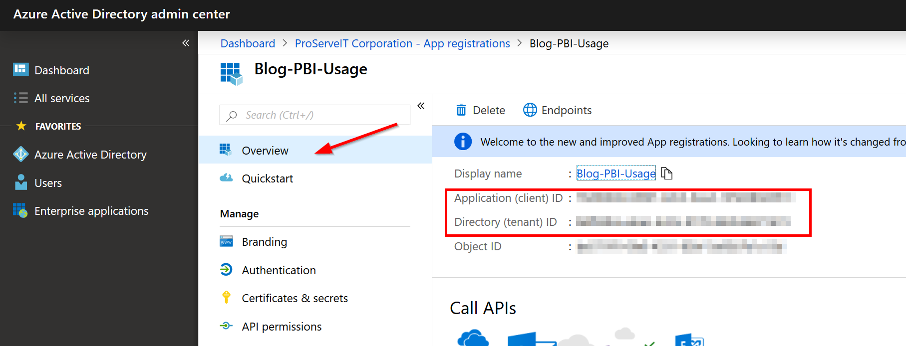

7. Create Client secret
   * A) Click Certificates and Secrets
   * B) Click New client secret
   * C) Enter a description
   * D) Click "Add"

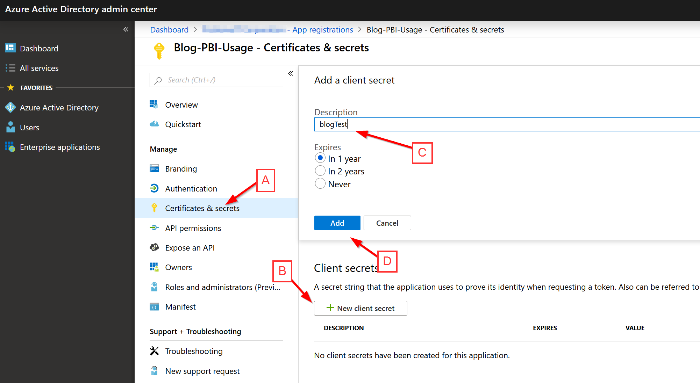

8. Gather Client secret
   * A) Copy the Client secret into notepad for use later

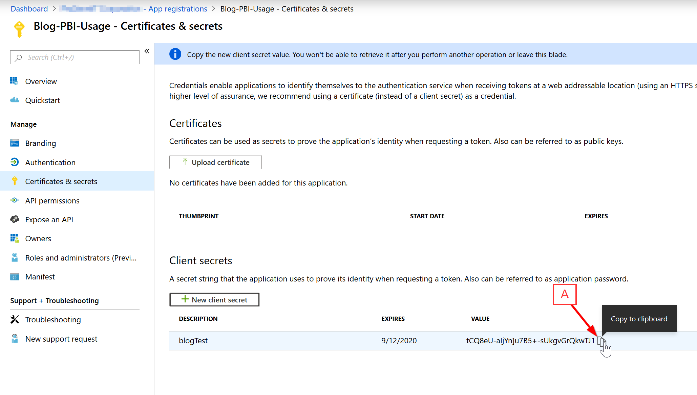


#### Create Power BI Streaming Dataset

1. Create Streaming dataset
   * A) Click +Create
   * B) Click on Streaming dataset

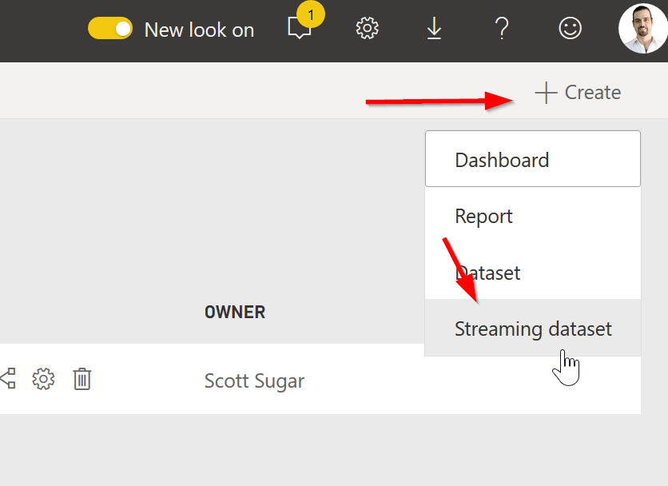

2. Select data source
   * A) Select API
   * B) Click Next

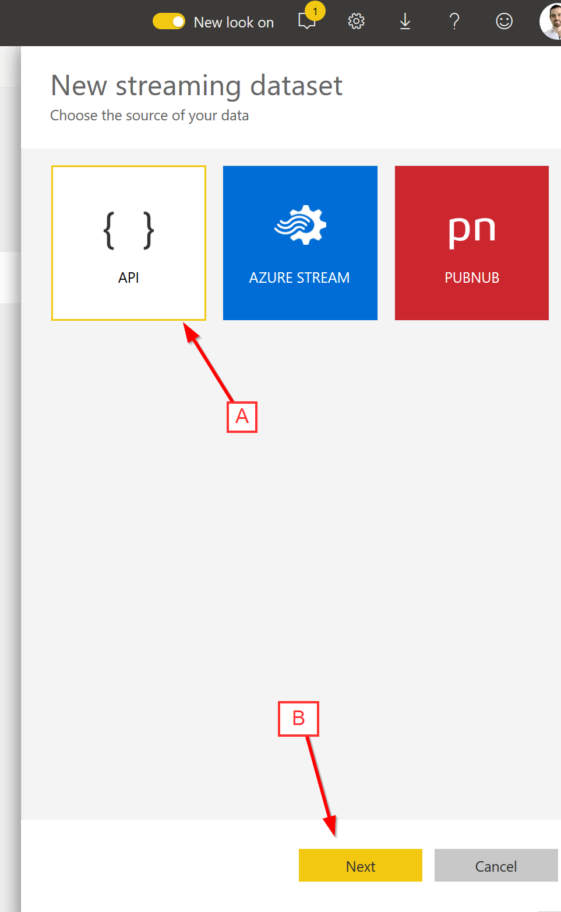

3. Enter dataset and field names
   * A) Enter a dataset name
   * B) Fill in the "Values from stream" section as per the screenshot below.
   * Note: CreationTime is type DateTime, everything else is text.

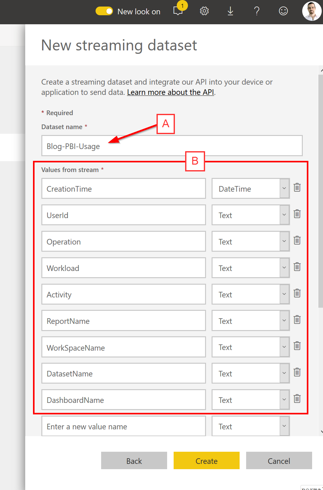

4. Turn on historical data analysis and create the dataset
   * A) Scroll down
   * B) Enable "Historical data analysis"
   * C) Click Create

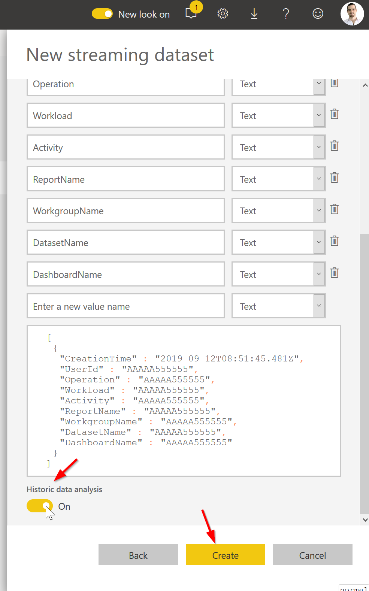

5. Gather PowerShell Code
   * A) Click on PowerShell
   * B) Copy the endpoint URL to notepad for use later
   * C) Click Done

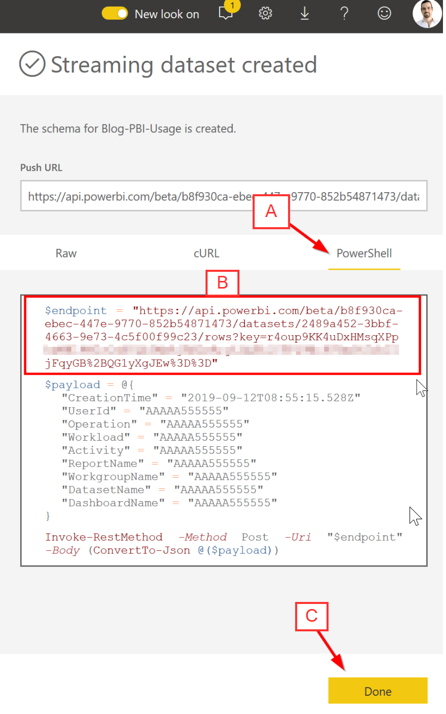

### Get-PowerBIUsage Script

The PowerShell script we'll use to grab the activity logs from the O365 Management API and load the results into a Power BI Streaming Dataset can be found [here](Scripts/Get-PowerBIUsage.ps1)

#### Update Script

Before trying to run the script, please update the variables at the top of the script with the values we copied into notepad

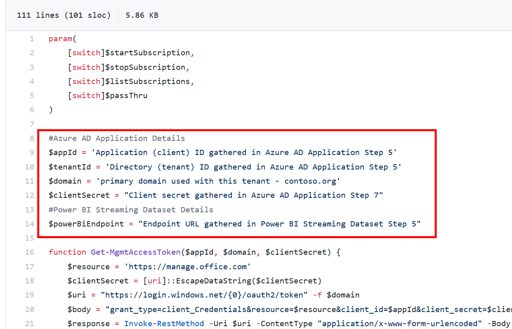

#### Run Script

To start, you'll need to "create a subscription" so the Management API will start to save your tenant's activities for later retrieval.

```` powershell
.\Get-PowerBIUsage.ps1 -startSubscription
````

#### Loop Script

The code below will continue to look for available activity logs every 15 minutes and push the log entries into to the streaming dataset.

```` powershell
while($true){
  .\Get-PowerBIUsage.ps1
  Start-Sleep -Seconds 900
}
````

### Create Power BI Report

At this point, you can start creating your Power BI report and answering some of the questions we had before.  As a start, let's look at what the most popular reports are in our tenant:

1. Create report
   * A) Click on Datasets
   * B) Click on Create report

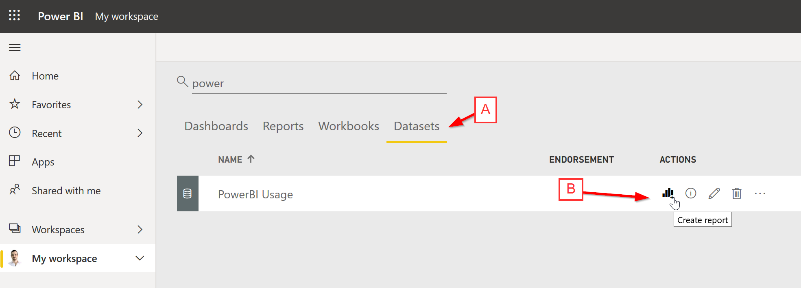

2. Create Top Operations by Report Name visualization
   * A) Click on the "Stacked bar chart" visualization
   * B) Drag-and-drop Report Name into the Axis
   * C) Drag-and-drop Operation into the Value (will become count of operation)

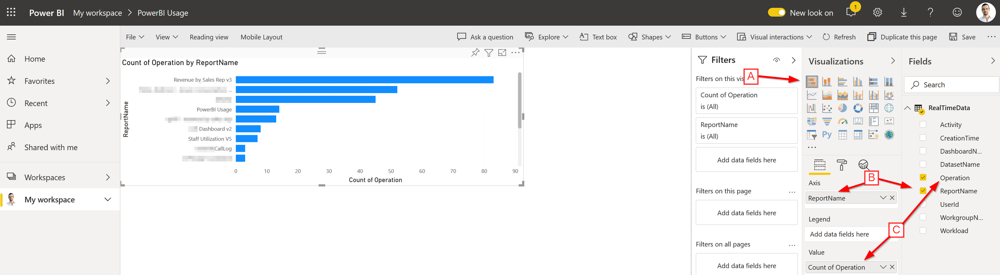

With the above in place, we can see that our "Revenue by Sales Rep v3" report is our most used (i.e. popular) report.  From there, we can add slicers and other visualizations or tables to continue to delve into our tenant's Power BI usage and find out "who's using the service, and what are they looking at?".

## Thoughts and Next Steps

This was a quick introduction to Azure AD Application authentication to the O365 Management Activity API, and to loading Power BI activity data into a Power BI streaming dataset.  

With some work, this could be expanded to capture other O365 activity data (Exchange, Sharepoint, Teams, DLP, ...), and could be used to save activity log information to long term storage (instead of a streaming dataset).  

Let us know what you're interested in, and that will help us tailor our future technical blog postings.  As always, if you have any issues, or would like to ask us any questions, please [reach out to us](mailto:cloud@proserveit.com?Subject=PowerBI%20Technical%20Question).
