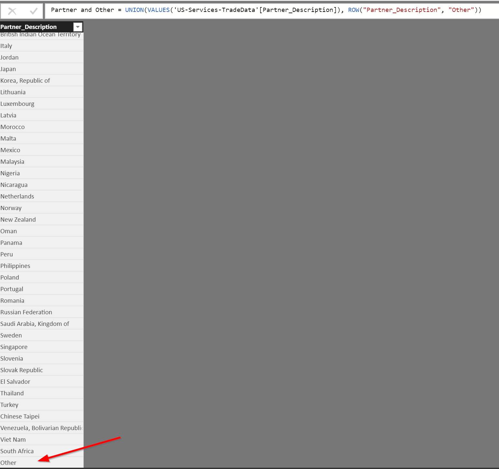

# PowerBI TopN and Other

## Problem Statement
Power BI has the ability to display the Top N within a visualization by using a visual level "Top N" filter.  There currently (Nov 2018) isn't any built-in functionality to show the Top N and aggregate the rest of the categories under an "Other" category.  

## Example Data
We're going to use US services trade data to show how to get Top N and Other working in Power BI.  Data is taken from here:
[full trade data](https://www.wto.org/english/res_e/statis_e/trade_datasets_e.htm)

To reduce the overall size of the trade data we're working with, we've filtered the data taken from the site above down to just data reported by the US.  The actual CSV file we're going to be working with is located here:
[US services trade data](exampledata/US-Services-TradeData.csv)

## Solution Walkthrough

### Create a Calculated Table with Trade Partners and Other
To start, we're going to create a Calculated Table (Modeling > New Table).  The DAX expression for this table will be:

````
Partner and Other = UNION(VALUES('US-Services-TradeData'[Partner_Description]), ROW("Partner_Description", "Other"))
````

This DAX expresssion creates a new table with all the trading partners, and an extra row at the end with a value of "Other"
{:height="50%" width="50%"}

